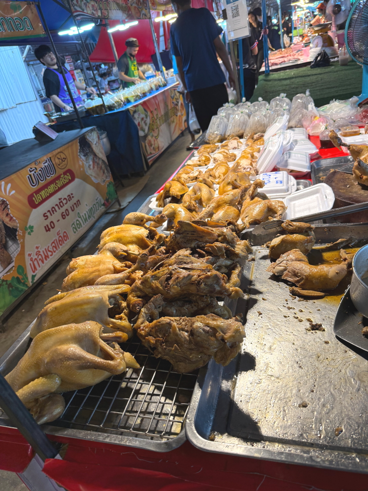
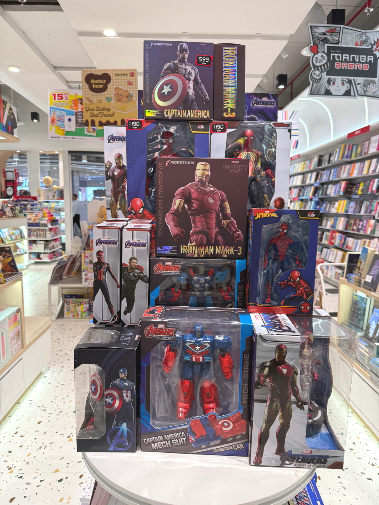
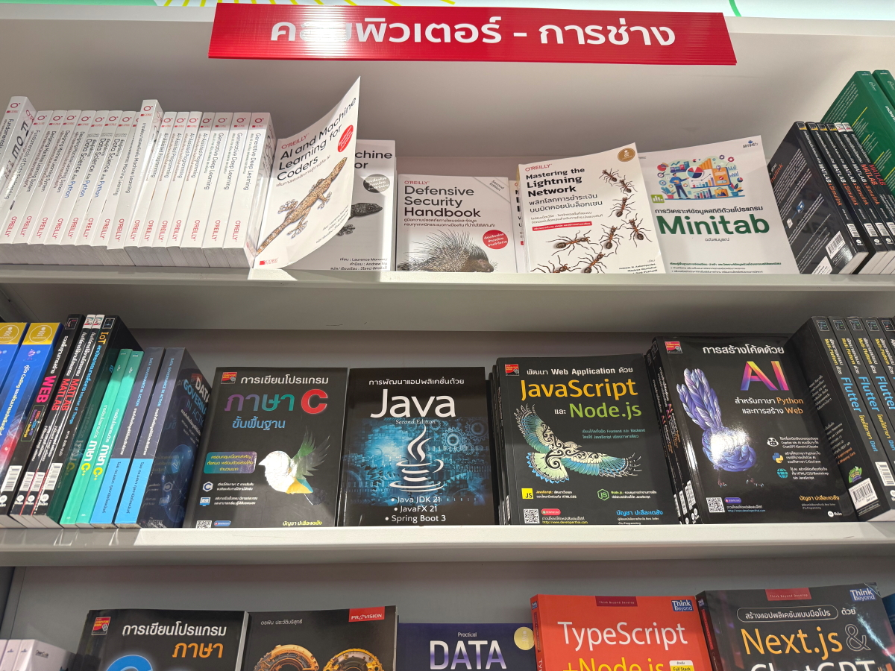
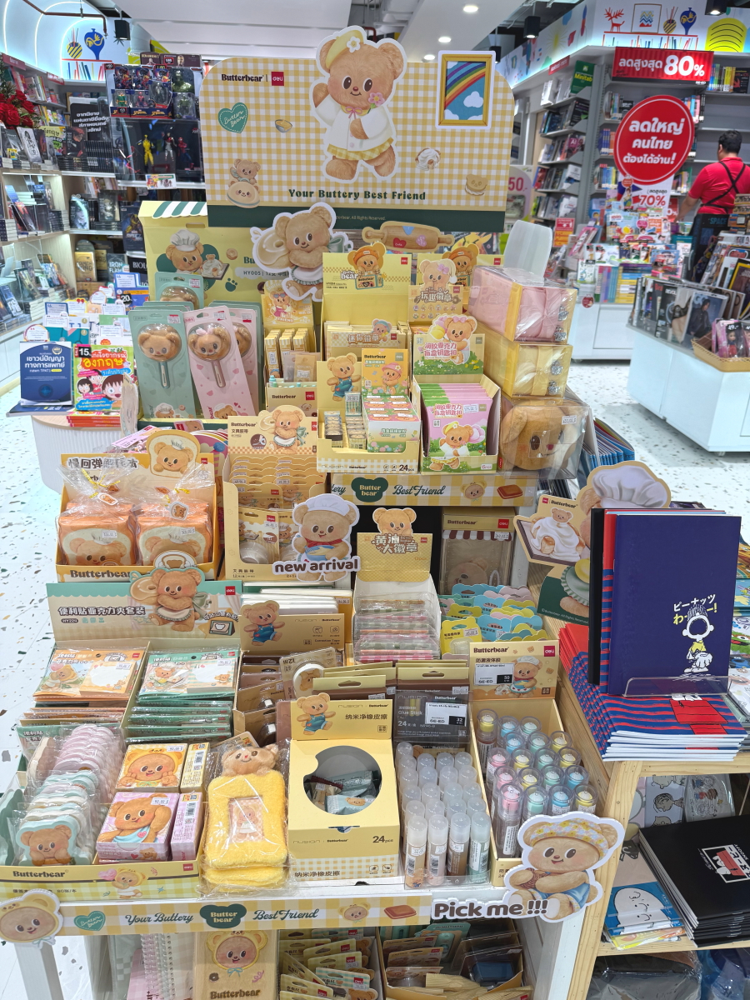

# 20250904_bangkok

<html lang="ja" data-loaded="false" data-scrolled="false" data-spmenu="closed">
<head>

<meta charset="UTF-8">
<meta http-equiv="Content-Type" content="text/html; charset=UTF-8">
<meta http-equiv="X-UA-Compatible" content="IE=EmulateIE10" />
<meta http-equiv="X-UA-Compatible" content="IE=edge">

<meta name="viewport" content="width=device-width, initial-scale=1.0">

<!--ここから上はお決まりの定型文です-->

<!--ここからが表現の書式などを決めるcssという部分-->

<link href="https://cdnjs.cloudflare.com/ajax/libs/lightbox2/2.7.1/css/lightbox.css" rel="stylesheet">

</head>

<body>

モバイル端末をお使いの場合は、画面を横向きにすると
背景画像の横方向がご覧頂けます。

<!--ここ上は、ほぼそのまま使います！-->

<!--QRコードの挿入例-->

 アクセス用QRコード

<marquee direction="left" scrollamount="20" width="30%">(^_^)/~alis</marquee>

<!--流れ文字の挿入例-->
<h1><marquee behavior="left">!!! 2025/09/02-04、住宅街のお花達から、市内市場とショッピングモール内の本屋さんまで!!!</marquee></h1>

                          

<!--ここから下が、本体部分-->
    

 
<h2>9月2日、生垣のお花が今日もにっこり</h2>

    
<h2>帰宅時間の中学生の通学トラック、写真撮ったのが女の子にばれちゃいました</h2>

    
<h2>午後は一転にわかにかき曇り、地平には入道雲が湧き上がりました</h2>

    
<h2>夕方はいつもの市場でお買い物</h2>

    
<h2>朝食のパンを購入して一枚パチリ！</h2>

    
<h2>まだ明るくてネオンは未点灯</h2>

    
<h2>3日、雨上がりの朝、生垣のお花が今日もにっこり</h2>

    
<h2>ガソリンスタンド併設のラーメン屋さんのメニュー 流石に全く読めません</h2>

    
<h2>注文用紙は使わずに、写真を指差してオーダー</h2>

    
<h2>北方系のタイの味付けのラーメン</h2>

    
<h2>会計はQRコード決済</h2>

    
<h2>会計が無事終わると飴をくれます</h2>

    
<h2>ペットショップで猫の餌を調達</h2>

    
<h2>レジのおじさんはスマホに夢中</h2>

    
<h2>昼下がりに、青空がのぞきました</h2>

    
<h2>露店の裏でおこぼれに群がる鳥の群れ</h2>

    
<h2>一休みした後にショッピングモールにお出かけ</h2>

    
<h2>午後は地平から入道雲が湧き立ちます</h2>

    
<h2>停車時間の長い交差点では中学生がジュースの販売</h2>

    
<h2>市街エリアはところどころで渋滞</h2>

    
<h2>時々車がす〜っとはけますが、バイクはいつもかなりの数走ってます</h2>

    
<h2>市内のスーパーで食料品調達</h2>

    
<h2>家電コーナーではJAPAN QUALITYを誇る冷蔵庫</h2>

    
<h2>電動バイクも売られてます</h2>

    
<h2>金物コーナーも盛大ですが、市場の金物屋さんの値段には敵いませんね〜</h2>

    
<h2>DONKI前の飲み物屋さんの電飾が派手</h2>

    
<h2>ITコーナーのPC,i7クラスのPCの価格感, 23,990 → 21,000バーツに値引きで約84,000円</h2>

    
<h2>グラボ違いでこの価格差</h2>

    
<h2>本屋さんがあったのでちょっと寄り道</h2>

    
<h2>フィギアコーナーもありました</h2>

    
<h2>IT関連コーナーは店の奥</h2>

    
<h2>入り口近くに子供向けグッズ</h2>

    
<h2>携帯屋さんの店先には、縦二つ折りの新商品</h2>

    
<h2>DONKI店内で日本の知り合いにそっくりなタイ人、一瞬びっくり！</h2>

    
<h2>女性陣のDONKI滞在時間が異様に長いです</h2>

    
<h2>3時間以上滞在したショッピングモールを出ると、外は真っ暗</h2>

    
<h2>タイのウナギおにぎり、具材は海苔でご飯の外に巻きます</h2>

    
<h2>4日、朝から晴天で雨上がりのお花を陽射しが包みます</h2>

         

<!--  
<h2>再掲【暑中お見舞い（ほたる）】LINEでご挨拶・動画で送る夏のグリーティングカード / ギターbgm/蛍の光・癒し動画</h2>

<iframe width="560" height="315" src="https://www.youtube.com/embed/Z4PKDOhRzfI?si=LaAJ8dA-1izGspEO" title="YouTube video player" frameborder="0" allow="accelerometer; autoplay; clipboard-write; encrypted-media; gyroscope; picture-in-picture; web-share" referrerpolicy="strict-origin-when-cross-origin" allowfullscreen></iframe>
    
   
-->   
    
    

  
<h2>今日のBGMは Phil Collins, Eric Clapton, Elton John, Lionel Richie, Bee Gees 📀 Soft Rock Full Album 70s, 80s, 90s</h2>

<iframe width="560" height="315" src="https://www.youtube.com/embed/BixZZ1pvASU?si=HAMJECyMqCIaJj2w" title="YouTube video player" frameborder="0" allow="accelerometer; autoplay; clipboard-write; encrypted-media; gyroscope; picture-in-picture; web-share" referrerpolicy="strict-origin-when-cross-origin" allowfullscreen></iframe>
    

    
  
<h2>8月17日にメタバースで披露されたまいてゃさんの新曲「Lonely game」</h2>

<iframe width="560" height="315" src="https://www.youtube.com/embed/HstFJ2_8oQA?si=QrYNv_EcIm7fALkV" title="YouTube video player" frameborder="0" allow="accelerometer; autoplay; clipboard-write; encrypted-media; gyroscope; picture-in-picture; web-share" referrerpolicy="strict-origin-when-cross-origin" allowfullscreen></iframe>
    

    
    

    
    
    <h3>「雪の中で輝くシンデレラ」by まいてゃ</h3>
<h2><a href="https://torokoid.github.io/20250219_chiangrai/maitiyaz.mp3" target="_blank">この文字クリックで再生します 下の再生ボタンでも同じ曲をループ再生します</a></h2>

    <audio controls loop>
        <source src="https://torokoid.github.io/20250219_chiangrai/maitiyaz.mp3" type="audio/mpeg">
        お使いのブラウザは audio タグをサポートしていません。
    </audio>
 
    
<!--
  
<h2>スティーブ・ジョブズの伝説の講義</h2> 
<iframe width="560" height="315" src="https://www.youtube.com/embed/XsRpvWHIVw0?si=f7IA0pv9iZWVk3VH" title="YouTube video player" frameborder="0" allow="accelerometer; autoplay; clipboard-write; encrypted-media; gyroscope; picture-in-picture; web-share" referrerpolicy="strict-origin-when-cross-origin" allowfullscreen></iframe>    
    
    
<h2>スティーブ・ジョブズ氏の講義の内容が「笑って死ぬ」by まいてゃ さんの歌の内容と大筋で同じに聞こえます 以下に再掲しますね</h2>

    
<h3>歌の後半部分しか撮れてませんが、2月16日のイベントで公開された「笑って死ぬ」 by まいてゃ 白ドレスはダンサーの玖遠さん、黒いドレスがまいてゃさん</h3>
<iframe width="560" height="315" src="https://www.youtube.com/embed/s4ZcbxAluMM?si=Xa32xo19UCNaWv0v" title="YouTube video player" frameborder="0" allow="accelerometer; autoplay; clipboard-write; encrypted-media; gyroscope; picture-in-picture; web-share" referrerpolicy="strict-origin-when-cross-origin" allowfullscreen></iframe> 
-->
    

    <h3>お気に入りの「笑って死ぬ」 by まいてゃさんも再々掲です</h3>
<h2><a href="https://torokoid.github.io/20250221_chiangrai/maitiya3.mp3" target="_blank">この文字クリックで再生します 下の再生ボタンで同じ曲をループ再生します</a></h2>

    <audio controls loop>
        <source src="https://torokoid.github.io/20250221_chiangrai/maitiya3.mp3" type="audio/mpeg">
        お使いのブラウザは audio タグをサポートしていません。
    </audio>

   
<h2>以上、住宅街のお花達から、市内市場とショッピングモール内の本屋さんまででした。 ここまでご覧いただきありがとうございました。</h2>

     
<h2>
<a href="https://torokoid.github.io/Mashiko_himawari_3/" target="_blank">クリックでメニューページに戻ります</a>
</h2>

   

<!-- hitwebcounter Code START -->
<a href="https://www.hitwebcounter.com" target="_blank">

あなたは 番目の訪問者です 数値は8月1日以降に立ち上げたバンコクシリーズHPの累計です
</a>   

         

  

      

<!--本体はここまで-->

<!--画面に空白地帯を作って、背景が見えるようにしています-->
                                              

<!-- フッタ -->
<footer>

Copyright 2025/09/04 alis @Bangkok

</footer>

<!--HPにさまざまなJavaScriptを呼び込むための書式-->

    
    </body>
    
</html>
